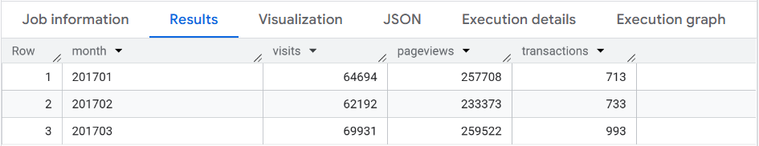
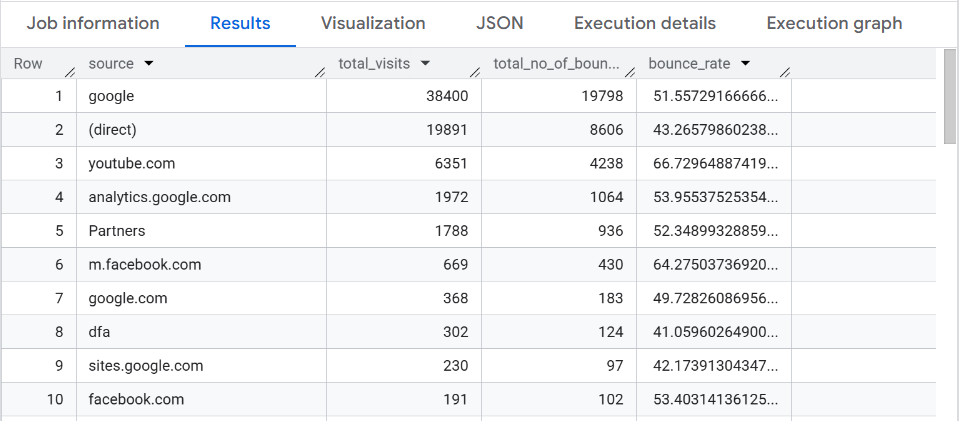
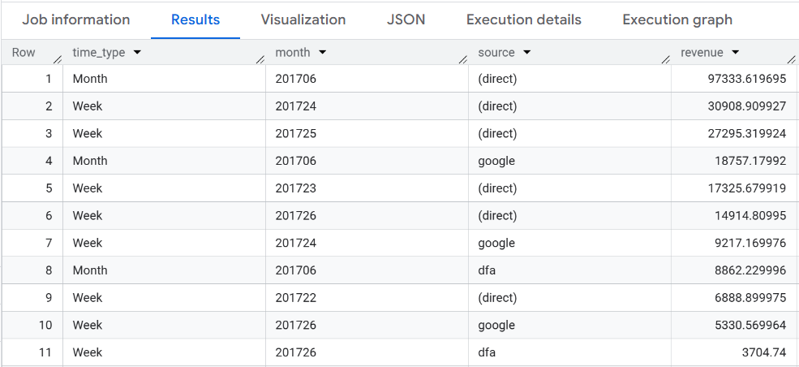
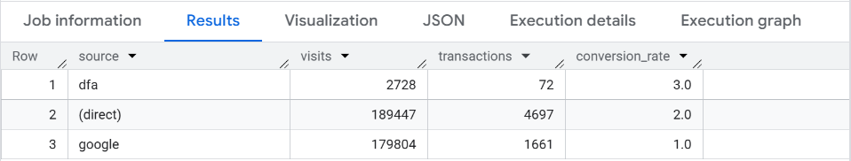
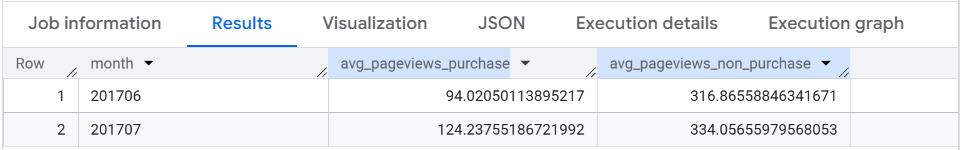
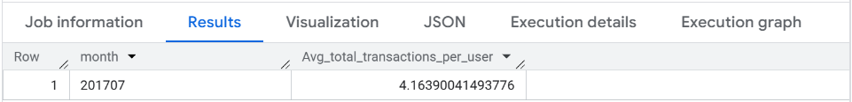
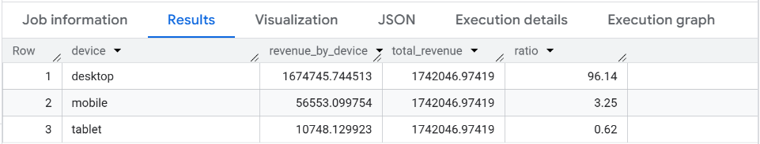
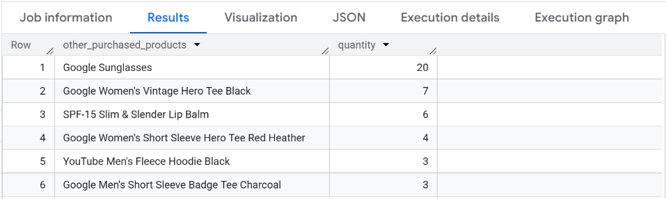
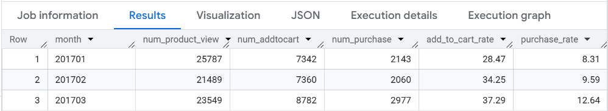
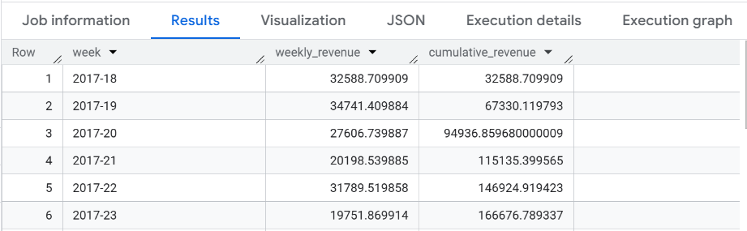

## 1. Project Overview

### Context

This project analyzes e-commerce website data from the Google Analytics Sample Dataset in BigQuery. The dataset contains user sessions, traffic sources, device categories, pageviews, transactions, product interactions, and revenue.

Using SQL, this project transforms raw web analytics data into structured analysis to better understand website performance and customer purchasing behavior.

### Business Problem

An e-commerce business needs to understand which traffic sources, customer behaviors, and product interactions contribute most to revenue. Without this analysis, it is difficult to evaluate marketing effectiveness, identify weak points in the customer journey, and find opportunities to improve conversion and sales.

This project answers the following key business questions:

- How did website traffic, pageviews, and transactions change over time?
- Which traffic sources brought high-quality traffic and revenue?
- How do purchasers and non-purchasers behave differently?
- Which devices and products contributed most to revenue?
- Where do users drop off in the funnel from product view to purchase?

### Objectives

The objective of this project is to use SQL in BigQuery to measure and compare key e-commerce performance indicators.

The analysis includes:

- Traffic, pageview, and transaction trends
- Bounce rate and conversion rate by traffic source
- Revenue by traffic source, week, month, and device category
- Purchaser versus non-purchaser behavior
- Product cross-selling opportunities
- Product funnel performance from view to add-to-cart to purchase
- Weekly and cumulative revenue trends


## 2. Data Source & Dataset Description

### Data Source

This project uses the Google Analytics Sample Dataset available in BigQuery Public Datasets.

The dataset contains Google Analytics session data from the Google Merchandise Store, an e-commerce website that sells Google-branded merchandise. It provides information about website sessions, traffic sources, user behavior, product interactions, transactions, and revenue.

This dataset is suitable for analyzing e-commerce website performance because it includes both user session data and product-level e-commerce data.

### Dataset Information

- Data source: Google Analytics Sample Dataset
- BigQuery project: `bigquery-public-data`
- Dataset: `google_analytics_sample`
- Tables used: `ga_sessions_YYYYMMDD`
- Example table: `ga_sessions_20170801`
- Query pattern used in this project: `bigquery-public-data.google_analytics_sample.ga_sessions_2017*`

The dataset is organized as daily session tables. Each table represents website session data for one specific date.

For example:

- `ga_sessions_20170801` contains session data for August 1, 2017.
- `ga_sessions_20170601` contains session data for June 1, 2017.

In this project, wildcard tables such as `ga_sessions_2017*` are used to query multiple daily tables from 2017 at the same time.

### How to Access the Data

1. Log in to your Google Cloud Platform account.
2. Open the BigQuery Console.
3. In the Explorer panel, click **Add data**.
4. Choose **Star a project by name** or search for a public project.
5. Enter the project ID: `bigquery-public-data`.
6. Open the dataset: `google_analytics_sample`.
7. Select the daily session tables named `ga_sessions_YYYYMMDD`.
8. For example, open `ga_sessions_20170801` to explore the table schema and sample data.

In this project, the following wildcard table pattern is used to query multiple daily tables from 2017:

```sql
`bigquery-public-data.google_analytics_sample.ga_sessions_2017*`
```

### Dataset Description

The dataset contains e-commerce website session data from the Google Analytics Sample Dataset in BigQuery. It includes information about visitors, session dates, traffic sources, device categories, pageviews, bounces, transactions, product interactions, product quantities, and product revenue.

The dataset contains both session-level data and nested e-commerce data. Session-level fields describe the overall visit, such as visitor ID, date, traffic source, device type, pageviews, bounces, and transactions. Nested fields provide more detailed information about user actions within each session, including product views, add-to-cart actions, purchases, and product-level revenue.

In BigQuery, fields such as `hits`, `hits.eCommerceAction`, and `hits.product` are nested or repeated fields. Therefore, `UNNEST()` is used in this project to access hit-level and product-level data for deeper e-commerce analysis.

### Key Fields Used

| Field Name | Description |
|---|---|
| `fullVisitorId` | Unique visitor ID |
| `date` | Session date in `YYYYMMDD` format |
| `totals.visits` | Number of sessions |
| `totals.pageviews` | Total number of pageviews in a session |
| `totals.bounces` | Bounce indicator. A bounced session has the value `1`; otherwise, the value is `null` |
| `totals.transactions` | Total number of e-commerce transactions in a session |
| `trafficSource.source` | Source of website traffic, such as search engine, referral website, or campaign source |
| `device.deviceCategory` | Device category, such as desktop, mobile, or tablet |
| `hits` | Nested and repeated field that contains hit-level data within a session |
| `hits.eCommerceAction.action_type` | E-commerce action type, such as product view, add-to-cart, checkout, or purchase |
| `hits.product.productQuantity` | Quantity of products purchased |
| `hits.product.productRevenue` | Product revenue, stored in micro-units |
| `hits.product.productSKU` | Product SKU |
| `hits.product.v2ProductName` | Product name |

## 3. Main Analysis Process

### Query 01: Monthly Website Traffic Overview

#### Business Question

How did total visits, pageviews, and transactions change across January, February, and March 2017?

#### Approach

This query groups website session data by month and calculates total visits, pageviews, and transactions. The purpose is to compare traffic volume, user engagement, and purchasing activity across January, February, and March 2017.

#### SQL Query

```sql
SELECT
  FORMAT_DATE("%Y%m", PARSE_DATE("%Y%m%d", date)) AS month,
  SUM(totals.visits) AS visits,
  SUM(totals.pageviews) AS pageviews,
  SUM(totals.transactions) AS transactions,
FROM `bigquery-public-data.google_analytics_sample.ga_sessions_2017*`
WHERE _TABLE_SUFFIX BETWEEN '0101' AND '0331'
GROUP BY 1
ORDER BY 1;
```

#### Query Result



Insight: March 2017 showed the strongest performance among the three months, with the highest number of visits, pageviews, and transactions. Although February had lower visits and pageviews than January, transactions still increased slightly, suggesting that traffic volume was not the only factor affecting purchase performance.

---

### Query 02: Bounce Rate by Traffic Source

#### Business Question

Which traffic sources had the highest bounce rate in July 2017?

#### Metric Definition

Bounce rate = total bounces / total visits

#### Approach

This query groups July 2017 sessions by traffic source and calculates total visits, total bounces, and bounce rate. The purpose is to identify which traffic sources brought visitors who left the website quickly without deeper engagement.

#### SQL Query

```sql
SELECT
    trafficSource.source AS source,
    SUM(totals.visits) AS total_visits,
    SUM(totals.Bounces) AS total_no_of_bounces,
    (SUM(totals.Bounces)/SUM(totals.visits))* 100.00 AS bounce_rate
FROM `bigquery-public-data.google_analytics_sample.ga_sessions_201707*`
GROUP BY source
ORDER BY total_visits DESC;
```

#### Query Result



Insight: Among the displayed traffic sources, `youtube.com` had the highest bounce rate, suggesting that visitors from this source were less likely to continue browsing after landing on the website. Google generated the highest number of visits, but its bounce rate was also relatively high, indicating that high traffic volume does not always mean high traffic quality.

---

### Query 03: Revenue by Traffic Source Over Time

#### Business Question

How much revenue did each traffic source generate by week and by month in June 2017?

#### Approach

This query calculates product revenue by traffic source in June 2017 at both monthly and weekly levels. It uses `UNNEST()` to access product-level revenue from nested fields, then combines monthly and weekly revenue results using `UNION ALL`.

#### SQL Query

```sql
WITH 
month_data AS(
  SELECT
    "Month" AS time_type,
    FORMAT_DATE("%Y%m", PARSE_DATE("%Y%m%d", date)) AS month,
    trafficSource.source AS source,
    SUM(p.productRevenue)/1000000 AS revenue
  FROM `bigquery-public-data.google_analytics_sample.ga_sessions_201706*`,
    UNNEST(hits) hits,
    UNNEST(product) p
  WHERE p.productRevenue IS NOT NULL
  GROUP BY 1,2,3
  ORDER BY revenue DESC
),
week_data AS(
  SELECT
    "Week" AS time_type,
    FORMAT_DATE("%Y%W", PARSE_DATE("%Y%m%d", date)) AS week,
    trafficSource.source AS source,
    SUM(p.productRevenue)/1000000 AS revenue
  FROM `bigquery-public-data.google_analytics_sample.ga_sessions_201706*`,
    UNNEST(hits) hits,
    UNNEST(product) p
  WHERE p.productRevenue IS NOT NULL
  GROUP BY 1,2,3
  ORDER BY revenue DESC
)

SELECT time_type, month, source, revenue  FROM month_data
UNION ALL
SELECT time_type, week, source, revenue  FROM week_data
ORDER BY revenue DESC;
```

#### Query Result



Insight: In June 2017, direct traffic generated the highest monthly revenue by a large margin, while Google was also an important revenue source. At the weekly level, revenue varied across traffic sources, showing that traffic source performance should be reviewed over time instead of only looking at the total monthly result.

---

### Query 04: Conversion Rate by Traffic Source

#### Business Question

Which traffic sources had the highest conversion rate in 2017?

#### Metric Definition

Conversion rate = total transactions / total visits

#### Approach

This query groups 2017 sessions by traffic source and calculates total visits, transactions, and conversion rate. The `HAVING` condition keeps only sources with at least 50 transactions, so the comparison focuses on traffic sources with meaningful purchase volume.

#### SQL Query

```sql
SELECT
  trafficSource.source,
  SUM(totals.visits) visits,
  SUM(totals.transactions) AS transactions,
  ROUND((SUM(totals.transactions)/ SUM(totals.visits)),2) * 100.00 AS conversion_rate
FROM  `bigquery-public-data.google_analytics_sample.ga_sessions_2017*`
GROUP BY source
HAVING SUM(totals.transactions) >= 50
ORDER BY conversion_rate DESC;
```

#### Query Result



Insight: DFA had the highest conversion rate at 3%, followed by direct traffic at 2% and Google at 1%. Although direct and Google brought much higher visit volume, DFA converted more efficiently, suggesting that traffic quality should be evaluated together with traffic volume.

---

### Query 05: Average Pageviews by Purchaser Type

#### Business Question

How did average pageviews differ between purchasers and non-purchasers in June and July 2017?

#### Approach

This query separates visitors into purchasers and non-purchasers. It calculates average pageviews per visitor for each group in June and July 2017, then joins both results by month to compare engagement between users who purchased and users who did not.

#### SQL Query

```sql
WITH 
purchaser_data AS(
  SELECT
      FORMAT_DATE("%Y%m",PARSE_DATE("%Y%m%d",date)) AS month,
      (SUM(totals.pageviews)/COUNT(DISTINCT fullvisitorid)) AS avg_pageviews_purchase,
  FROM `bigquery-public-data.google_analytics_sample.ga_sessions_2017*`
    ,UNNEST(hits) hits
    ,UNNEST(product) product
  WHERE _table_suffix BETWEEN '0601' AND '0731'
  AND totals.transactions>=1
  AND product.productRevenue IS NOT NULL
  GROUP BY month
),
non_purchaser_data AS(
  SELECT
      FORMAT_DATE("%Y%m",PARSE_DATE("%Y%m%d",date)) AS month,
      SUM(totals.pageviews)/COUNT(DISTINCT fullvisitorid) AS avg_pageviews_non_purchase,
  FROM `bigquery-public-data.google_analytics_sample.ga_sessions_2017*`
      ,UNNEST(hits) hits
      ,UNNEST(product) product
  WHERE _table_suffix BETWEEN '0601' AND '0731'
  AND totals.transactions IS NULL
  AND product.productRevenue IS NULL
  GROUP BY month
)

SELECT
    pd.*,
    avg_pageviews_non_purchase
FROM purchaser_data pd
FULL JOIN non_purchaser_data USING(month)
ORDER BY pd.month;
```

#### Query Result



Insight: Non-purchasers had higher average pageviews than purchasers in both June and July 2017. This may suggest that non-purchasing users spent more time browsing but did not convert, indicating a possible gap between product exploration and purchase decision.

---

### Query 06: Average Transactions per Purchasing User

#### Business Question

How many transactions did each purchasing user make on average in July 2017?

#### Approach

This query focuses on visitors who completed at least one transaction in July 2017. It calculates the average number of transactions per purchasing user by dividing total transactions by the number of distinct visitors who made purchases.

#### SQL Query

```sql
SELECT
    FORMAT_DATE("%Y%m",PARSE_DATE("%Y%m%d",date)) AS month,
    SUM(totals.transactions)/COUNT(DISTINCT fullvisitorid) AS Avg_total_transactions_per_user
FROM `bigquery-public-data.google_analytics_sample.ga_sessions_201707*`
    ,UNNEST (hits) hits
    ,UNNEST (product) product
WHERE  totals.transactions>=1
AND product.productRevenue IS NOT NULL
GROUP BY month;
```

#### Query Result



Insight: In July 2017, purchasing users made an average of about 4.16 transactions. This suggests that users who converted were not limited to one-time purchases and may have shown repeat purchasing behavior within the period.

---

### Query 07: Revenue Contribution by Device Category

#### Business Question

Which device categories contributed the most to total revenue?

#### Metric Definition

Revenue contribution = device revenue / total revenue

#### Approach

This query calculates revenue by device category and compares each device’s revenue with total revenue. The purpose is to understand which device categories contributed the largest share of e-commerce revenue.

#### SQL Query

```sql
WITH 
raw_data AS (
  SELECT
    device.deviceCategory AS device
    ,SUM(productRevenue)/1000000 AS revenue_by_device
    ,(SELECT SUM(productRevenue)/1000000 AS total_revenue
      FROM `bigquery-public-data.google_analytics_sample.ga_sessions_*`
            ,UNNEST(hits) hits
            ,UNNEST(product) product
      WHERE totals.transactions>=1
        AND product.productRevenue IS NOT NULL) AS total_revenue
  FROM `bigquery-public-data.google_analytics_sample.ga_sessions_*`
        ,UNNEST(hits) hits
        ,UNNEST(product) product
  WHERE totals.transactions>=1
    AND product.productRevenue IS NOT NULL
  GROUP BY device
  ORDER BY revenue_by_device DESC)

SELECT
  device
  ,revenue_by_device
  ,total_revenue
  ,ROUND(100.00*(revenue_by_device/total_revenue),2) AS ratio
FROM raw_data;
```

#### Query Result



Insight: Desktop contributed the majority of total revenue, accounting for 96.14%, while mobile and tablet contributed only a small share. This suggests that desktop was the main revenue-driving device category, and mobile performance may need further review despite its role in e-commerce traffic.

---

### Query 08: Product Cross-Sell Analysis

#### Business Question

Which other products were commonly purchased by customers who bought "YouTube Men's Vintage Henley" in July 2017?

#### Approach

This query first identifies visitors who purchased “YouTube Men's Vintage Henley” in July 2017. It then finds other products purchased by the same visitors and ranks those products by quantity sold. This helps identify potential cross-selling opportunities.

#### SQL Query

```sql
WITH 
buyer_list AS(
    SELECT
        DISTINCT fullVisitorId  
    FROM `bigquery-public-data.google_analytics_sample.ga_sessions_201707*`
    , UNNEST(hits) AS hits
    , UNNEST(hits.product) AS product
    WHERE product.v2ProductName = "YouTube Men's Vintage Henley"
    AND totals.transactions>=1
    AND product.productRevenue IS NOT NULL
)
SELECT
  product.v2ProductName AS other_purchased_products,
  SUM(product.productQuantity) AS quantity
FROM `bigquery-public-data.google_analytics_sample.ga_sessions_201707*`
, UNNEST(hits) AS hits
, UNNEST(hits.product) AS product
JOIN buyer_list USING(fullVisitorId)
WHERE product.v2ProductName != "YouTube Men's Vintage Henley"
 AND product.productRevenue IS NOT NULL
 AND totals.transactions>=1
GROUP BY other_purchased_products
ORDER BY quantity DESC;
```

#### Query Result



Insight: Google Sunglasses was the most commonly purchased product together with “YouTube Men's Vintage Henley”, with 20 units ordered. This suggests a possible cross-selling opportunity by recommending frequently co-purchased products to customers who view or buy the Henley product.

---

### Query 09: Product Funnel Analysis

#### Business Question

How did users move through the product funnel from product view to add-to-cart to purchase in January, February, and March 2017?

#### Metric Definitions

Add-to-cart rate = number of products added to cart / number of product views

Purchase rate = number of products purchased / number of product views

#### Approach

This query measures the product funnel across three stages: product view, add-to-cart, and purchase. It counts the number of product SKUs at each stage by month, then calculates add-to-cart rate and purchase rate based on product views.

#### SQL Query

```sql
WITH
product_view AS(
  SELECT
    FORMAT_DATE("%Y%m", PARSE_DATE("%Y%m%d", date)) AS month,
    COUNT(product.productSKU) AS num_product_view
  FROM `bigquery-public-data.google_analytics_sample.ga_sessions_*`
  , UNNEST(hits) AS hits
  , UNNEST(hits.product) as product
  WHERE _TABLE_SUFFIX BETWEEN '20170101' AND '20170331'
  AND hits.eCommerceAction.action_type = '2'
  GROUP BY 1
),
add_to_cart AS(
  SELECT
    FORMAT_DATE("%Y%m", PARSE_DATE("%Y%m%d", date)) AS month,
    COUNT(product.productSKU) AS num_addtocart
  FROM `bigquery-public-data.google_analytics_sample.ga_sessions_*`
  , UNNEST(hits) AS hits
  , UNNEST(hits.product) AS product
  WHERE _TABLE_SUFFIX BETWEEN '20170101' AND '20170331'
  AND hits.eCommerceAction.action_type = '3'
  GROUP BY 1
),
purchase AS(
  SELECT
    FORMAT_DATE("%Y%m", PARSE_DATE("%Y%m%d", date)) AS month,
    COUNT(product.productSKU) AS num_purchase
  FROM `bigquery-public-data.google_analytics_sample.ga_sessions_*`
  , UNNEST(hits) AS hits
  , UNNEST(hits.product) AS product
  WHERE _TABLE_SUFFIX BETWEEN '20170101' AND '20170331'
  AND hits.eCommerceAction.action_type = '6'
  AND product.productRevenue IS NOT NULL   
  GROUP BY 1
)
SELECT
    pv.*,
    num_addtocart,
    num_purchase,
    ROUND(num_addtocart*100/num_product_view,2) AS add_to_cart_rate,
    ROUND(num_purchase*100/num_product_view,2) AS purchase_rate
FROM product_view pv
LEFT JOIN add_to_cart a ON pv.month = a.month
LEFT JOIN purchase p ON pv.month = p.month
ORDER BY pv.month;
```

#### Query Result



Insight: Although product views fluctuated across the three months, both add-to-cart rate and purchase rate improved steadily from January to March 2017. March recorded the strongest funnel performance, with an add-to-cart rate of 37.29% and a purchase rate of 12.64%, suggesting improved conversion efficiency from product view to purchase.

---

### Query 10: Weekly and Cumulative Revenue

#### Business Question

How did weekly revenue and cumulative revenue change from May to July 2017?

#### Approach

This query calculates weekly revenue from May to July 2017 using product-level revenue data. It then uses a window function to calculate cumulative revenue over time, making it possible to track both weekly revenue movement and total revenue growth.

#### SQL Query

```sql
WITH 
raw_data AS ( 
  SELECT
    FORMAT_DATE("%Y-%W", PARSE_DATE("%Y%m%d", date)) AS week
    ,SUM(p.productRevenue)/1000000 AS weekly_revenue
  FROM
    `bigquery-public-data.google_analytics_sample.ga_sessions_2017*`,
  UNNEST(hits) hits,
      UNNEST(product) p
  WHERE _table_suffix BETWEEN '0501' AND '0731'
  AND p.productRevenue IS NOT NULL
  GROUP BY week
  ORDER BY week
)
SELECT
  week
  ,weekly_revenue
  ,SUM(weekly_revenue) OVER(ORDER BY week
                           ROWS BETWEEN UNBOUNDED PRECEDING AND CURRENT ROW) As cumulative_revenue
FROM raw_data
ORDER BY week;
```

#### Query Result



Insight: Cumulative revenue increased steadily from week 18 to week 31, reaching 425,257.70 by the end of the period. However, weekly revenue fluctuated across weeks, with week 29 generating the highest weekly revenue and week 31 showing the lowest weekly revenue among the displayed weeks.

